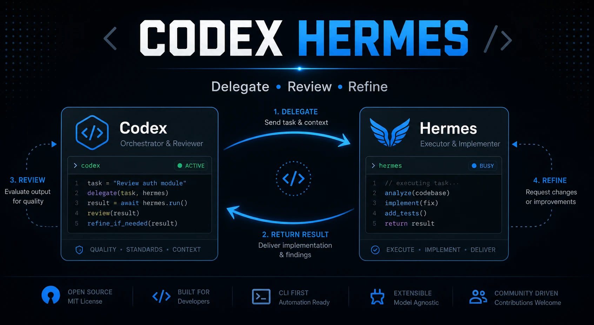

# cormes

[日本語](README.md) / [English](README.en.md) / [简体中文](README.zh-CN.md)



这是一个实验性的 Codex plugin，用于把 Codex App 中的任务转交给本地
Hermes CLI，然后由 Codex 审查 Hermes 返回的结果，再继续处理。

Cormes 是 Codex 侧的 wrapper。它委托外部 `hermes` CLI 执行任务，并把 Hermes
回答当作 untrusted data 交给 Codex 审查。

## 演示


这个演示展示了 plain `hermes` 和 Cormes 的区别：plain Hermes 会直接返回
模型回答；Cormes 会把该回答当作 untrusted data，先与本地仓库内容核对，
再返回经过审查的最终回答。

## 最新版本

- [v0.1.2 - Public metadata cleanup for installable-first distribution](https://github.com/na-navi/Codex-hermes/releases/tag/v0.1.2)
- [v0.1.1 - Initial verified Codex App <-> Hermes CLI bridge](https://github.com/na-navi/Codex-hermes/releases/tag/v0.1.1)
- 目前还没有附带二进制文件或 bundle。请直接使用仓库源码。

## 前置条件

- Codex App
- 已安装并可通过 `PATH` 调用的 `hermes` CLI
- 已 clone 到本地的本仓库

## 安装

1. 先在终端中确认 Hermes 可以正常运行。

```text
hermes --help
```

如果这个命令失败，请先修复 Hermes。没有可用的 Hermes CLI 时，这个 plugin
无法与 Hermes 通信。

2. 将 plugin 安装到 Codex plugin 目录。

```powershell
$pluginRoot = "$env:USERPROFILE\.codex\plugins\cormes"
Remove-Item -Recurse -Force $pluginRoot -ErrorAction SilentlyContinue
New-Item -ItemType Directory -Force -Path $pluginRoot | Out-Null
Copy-Item -Recurse -Force .codex-plugin, skills, commands, scripts, assets, README.md, README.en.md, README.zh-CN.md, LICENSE $pluginRoot
```

3. 重启 Codex App，或打开一个新 thread，以刷新 plugin skill 列表。

4. 在本仓库中运行 validator。

```text
python scripts/validate-plugin.py
```

5. 如果要在本仓库中开发，可以选择启用本地 Git hook。

```text
git config core.hooksPath .githooks
```

## 开发模式

当本仓库是当前 Codex workspace 时，Codex 也可以发现
`.agents/skills/cormes/SKILL.md` 中的 repo-local skill。这对开发 plugin
很有用，但不足以支持在其他文件夹中使用。

如果要从其他 workspace 使用，请把它安装为 plugin，让 Codex 能够加载：

```text
%USERPROFILE%\.codex\plugins\cormes\skills\cormes\SKILL.md
```

## 测试 Hermes 连接

1. 在任意 workspace 中，通过 Codex 调用 Cormes skill 执行一个短任务。

```text
$cormes say hello
```

2. 等待运行完成。
3. 确认输出中包含以下内容。

- `MODEL=...`
- `SESSION_ID=...`
- `RESPONSE_BEGIN`
- `RESPONSE_BEGIN` 后面的 Hermes 回复

如果看到 `Hermes CLI was not found on PATH`，说明 CLI 没有安装，或者当前 shell
无法找到它。

如果没有看到 `SESSION_ID`，说明 Hermes 没有返回 session marker。不过返回的回复
本身仍然可能是有效的。

## 兼容性

`$cormes` 是主要的 Codex skill invocation。legacy `$hermes` 不再作为独立 skill alias 保留，因为那会继续混淆 wrapper 和依赖项的名称。

外部 CLI binary 仍然是 `hermes`。legacy env var `CODEX_HERMES_STATE_DIR` 和 `CODEX_HERMES_REPO_ROOT` 仍作为 rename 期间的 fallback alias 被接受。

## 重要文件

- [`.codex-plugin/plugin.json`](.codex-plugin/plugin.json)
- [`skills/cormes/SKILL.md`](skills/cormes/SKILL.md)
- [`.agents/skills/cormes/SKILL.md`](.agents/skills/cormes/SKILL.md)
- [`scripts/invoke-cormes.py`](scripts/invoke-cormes.py)
- [`scripts/validate-plugin.py`](scripts/validate-plugin.py)
